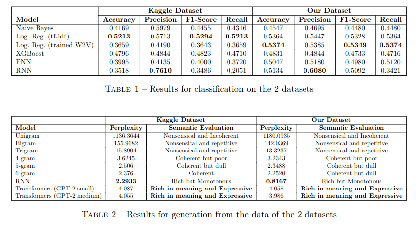
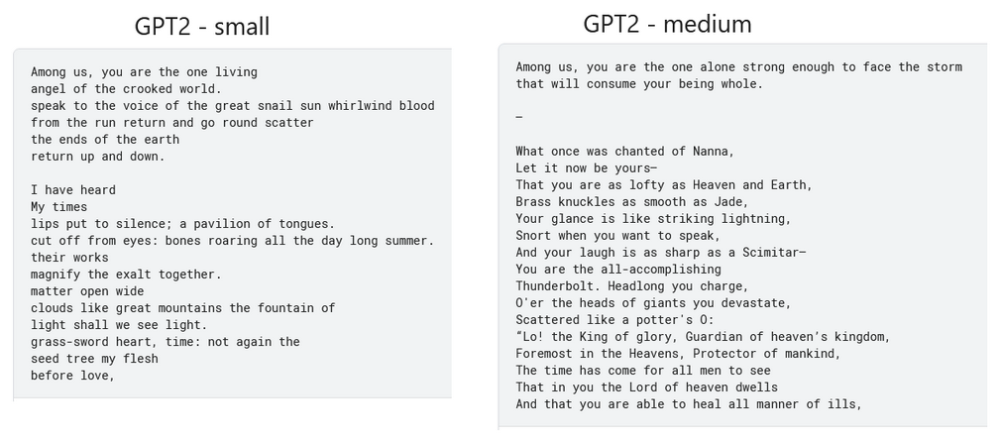

# NLP_Project: Poem Classification and Generation

## Project Overview
This project focuses on the classification and generation of poems, as well as web scraping to create our own dataset. The project is divided into several components, each utilizing different technologies and frameworks.

## Datasets Used

1. **First dataset for generation**: [Kaggle - Poetry Foundation Poems](https://www.kaggle.com/datasets/tgdivy/poetry-foundation-poems/data)
2. **Second dataset for generation**: [Kaggle - Complete Poetryfoundationorg Dataset](https://www.kaggle.com/datasets/johnhallman/complete-poetryfoundationorg-dataset)
3. **Kaggle dataset for generation**: [Kaggle - Poem Classification NLP](https://www.kaggle.com/datasets/ramjasmaurya/poem-classification-nlp)
4. **Our first dataset for classification** (144 possible classes): [Kaggle - Poems Dataset NLP (topics part)](https://www.kaggle.com/datasets/michaelarman/poemsdataset?select=topics)
5. **Creation of our own dataset for classification** (5 possible classes): [Kaggle - Poems Classification Dataset](https://www.kaggle.com/datasets/djdonpablo/poem-classification-dataset)
6. **Poetry Foundation Terms of Service for Robots**: [Poetry Foundation Robots.txt](https://www.poetryfoundation.org/robots.txt)

Our dataset was made by scraping the Poetry Foundation website for classification. It contains five different topics: nature, art & sciences, love, relationships, and religion, which are fairly well distributed.

**See**: [Kaggle Dataset](https://www.kaggle.com/datasets/djdonpablo/poem-classification-dataset)

## Technologies and Frameworks Used

```
src
├── classification
│   ├── FNN
│   ├── Logistic Regression & Naive Bayes
│   ├── RNN / LSTM
│   ├── Transformers
│   └── XGBoost
└── generation
    ├── Ngram
    ├── Transformers
    └── RNN
```

## Project Results



## Poem Generation Examples



## Members

- angelo.eap
- valentin.san
- christophe.nguyen
- alexandre.devaux-riviere
- paul.duhot
- mael.reynaud
